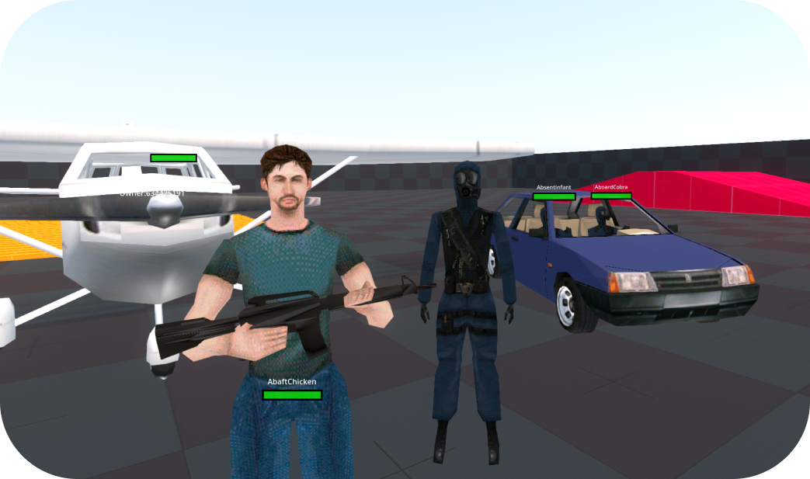
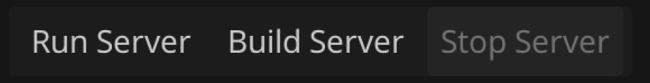
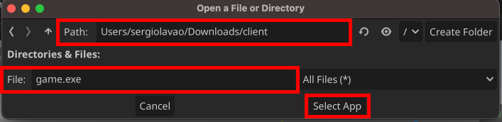

# TPS Multiplayer Godot Project

<p align="center">
	<a></a>
</p>

[](https://discord.gg/QHnXgEeN)

# Project Setup Instructions

## Prerequisites

Before you start building the Godot Project, make sure you have the required files downloaded and set up based on your operating system.

### Windows

1. Download the file from the following link:
   [build_winx86_v0.0.9.zip](https://tpsmp-builds.s3.amazonaws.com/experimental/build_winx86_v0.0.9.zip)
2. Unzip the downloaded file.

### MacOS

1. Download the file from the following link:
   [build_macos_v0.0.9.zip](https://tpsmp-builds.s3.amazonaws.com/experimental/build_macos_v0.0.9.zip)
2. Install the downloaded file.

## Building the Server

Once you have the required files downloaded and set up, you can run and build the server using the following buttons:



Follow these steps to ensure a smooth build process:

1. Open the Godot editor.
2. Load the project.
3. Use the specified buttons (as shown in the image above) to run and build the server.
4. Select the downloaded .exe in the previous step 



Enjoy!

# Documentation

Due to the early development, we highly recommend to join the [Discord Server](https://discord.gg/QHnXgEeN) to solve questions about the API and the functions provided 

## API

The project provides server functions to build you own game such as the following example: 

``` 

extends Node

@export var characters: Array[ PackedScene ]
@export var criminalSpawnPoint : Marker3D
@export var swatSpawnPoint : Marker3D

var _player_counter : int = 0

func _init():
	GDServer.SetOnPlayerSpawnedFunction( on_player_spawned )

func _ready():
	GDLogger.WriteLine("_server_version_", "Server: v1.1.0", Color.WHITE )
	GDCharacterModels.BindModels( characters )

func on_player_spawned( playerID : int ):
	_player_counter += 1
	
	if _player_counter % 2 == 0: #If its odd go to Criminal Team
		GDCharacterSpawner.SpawnPlayerCharacter( criminalSpawnPoint.global_position , Vector3.UP, playerID, 0 )
	
	if _player_counter % 2 != 0: #If its even go to SWAT Team
		GDCharacterSpawner.SpawnPlayerCharacter( swatSpawnPoint.global_position , Vector3.UP, playerID, 1 )

``` 

## Additional Notes

- Ensure you have the latest version of Godot installed and TPS Version.
- If you encounter any issues during the build process, leave a message on the [Discord Server](https://discord.gg/QHnXgEeN)

Happy coding!